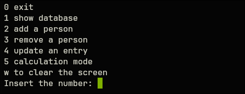
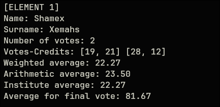

# AVERAGE CALCULATION (v1.0.0)

## Project Status

This project is currently considered in pause and is no longer under active development.

The application fulfills its original goal of managing academic grades and calculating averages. For the purpose of a person should be enough.

Future improvements are listed in the "Further Development Ideas" section, but no additional features are currently planned.

## WHY?
During my university years, I often wondered how the grade af a particular exam would affect my GPA. To calculate it, I usually relied on my phone's calculator, manually entering every grade along with it's corresponding credits each time. 

As you can immagine, this process quickly became tedious. One day I thought: "why not write some code to do it for me instead" (I didn't think to use excel, at the time).

So I started working on this small project. 

## REQUIREMENTS AND INSTALLATION
- Linux only. 
- written entirely in C
- use only standard libraries
For details see the technical details section.

## DOWNLOAD
Clone the repo with: 
`git clone https://github.com/Sh4m3X/mediaCalc`
Alternatively, you can download the source code directly from your browser.

## MAKEFILE
Once you have obtained the repo and entered its project directory, just type:
`make`
To execute makefile and compile the source code

## RUN
After compilation, run the executable with:
`./calc`

## FEATURES
When started, the program first requires permissions to create a file named "database.bin" in the current directory.

This file is used to store data between sessions. If the file cannot be instantiated the program terminates.

Once the program is running, whe following operations are available:

- Show database: Displays all entry stored in the database, including informations such as, names, surnames, grades, averages and other relevant information.

- Add a person: Create a new entry in the database

- Remove a person: Removes an existing entry from the database

- Update an entry: Modifies an existing entry. Entry are identified using the combination of "name surname".

- Calculation mode: Simulates how a person's average would change after adding hypothetical grades, without modifying the stored data.

- Clear: clears the terminal screen.

- Exit: terminates the program.

<p align="center">
  
</p>


## NOTES
The program computes four different averages according to the grading rules used by my university.

- Weighted Average: A weighted average where the number of credits acts as the weight of each grade.

$$
  \frac{\sum (grade \cdot credit)}{\sum credit}
$$

- Arithmetic Average: the standard arithmethic average


$$ 
  \frac{\sum (grade)}{\text{num of grades}}
$$

- Institute Average: this average is calculated by treating a laude as 31/30

$$ 
  \frac{\sum (grade \cdot credit)}{\sum credit}
$$

- Final average: the projected final graduation score on a 110-point scale

$$ 
  \frac{Institute average}{30} \cdot 110 
$$

<p align="center">
  
</p>

Grades input format: Grades must be entered using following format:
"grade-credit"
and must respect the allowed ranges enforced by the program

<p align="center">
  
</p>

LIMITATION:
The program does not currently support distinguishing between multiple people with the same name and surname. When searching for an entry, only the first matching record is returned.

## TECHNICAL DETAILS
### Repo structure 
```text
./mediaCalc
├─ /makefile
├─ /images
├─ /include
│  ├── calcMedia.h
│  ├── calculation.h
│  ├── list.h
│  ├── storage.h
│  └── utils.h
├─ /src
│  ├── calcMedia.c
│  ├── calculation.c
│  ├── list.c
│  ├── storage.c
│  └── utils.c
└── README.md
```
The program execution starts from calcMedia.c, which handles user interaction and the main application loop. 
- calculation.c: implements all average and grade-realted computations.
- list.c: implementss linked list data structure and its operations.
- storage.c: manages laoding and saving data to database.bin.
- utils.c: contains utility/helper functions used across the project.

### Data structure
The application uses a singly linked list as its main data structure. Each node contains:
- a pointer to the next element (`next`)
- a person structure (`data`) containing the stored information 

A person structure is defined as:
- Name (length 50)
- Surname (length 50)
- Votes (array of 50 elements)
- Credits (array of 50 elements)
- Number of votes

Each vote i paired with a corresponding credit value.

### DESIGN DECISIONS
The project went through multiple design approaches for storing grade data:
1. Storing precomputed averages
This approach was discarded almost immediatly, because it does not allow recomputation when modifying or simulating new grades

2. Storing only numarator and denominator
This was partially usable but too limited and fragile for more complex operations

3. Storing full (grade, credit) pairs (actual implamantation):
It preserves all raw information required for:
- accurate recomputation of average
- simulation of hypotetical grades
- flexible future extensions

An additional possible optimization would be caching computed averages to reduce repeated calculations, but the current implementation prioratize correctness and simplicity.

The program assumes a maximum of 50 votes/grades per student, as this limit is rarely exceeded in typical academic contexts. This design simplifies memory management and keeps the implementation strightforward. A future improvement could implement dynamically allocated memory, allowing an arbitrary number of votes/grades.

### IDENTIFICATION STRATEGY
Each person is identified using the combination
`<name,surname>`
However this introduces a limitation: duplicate entries with the same name and surname are not properly handled. In such cases only the first match is returned.

A more robust solution would be to introduce a unique identifier (ID) for each entry. This would:
- Eliminate collisions
- improve look up efficiency
- Simplify future database scaling

### PLATFORM COMPATIBILITY
This software is currently Linux-only because it uses 
`system("clear")` 
for terminal clearing functionality

A cross-platform version could be implemented by detecting the operating system at compile time or runtime and switching between `clear` and `cls`.

Additionally this method introduces an unnecessary dependency on the system shell. While no user input is passed to the command is, avoiding `system()` is generally a good practice. Future versions may replace it with ANSI escape sequences or a platform independent solutions.

### FURTHER DEVELOPMENT IDEA
1. Introduce a unique ID system for students
2. Introduce SUBJECT structure: Replace the separate grades and credits arrays with a Subject record that stores the subject name, grade, and credits toget
3. Dynamically allocate memory for votes and grades
4. Replace the binary file with a structured database solution
5. Change `system('clear')` with a portable alternativeher.


